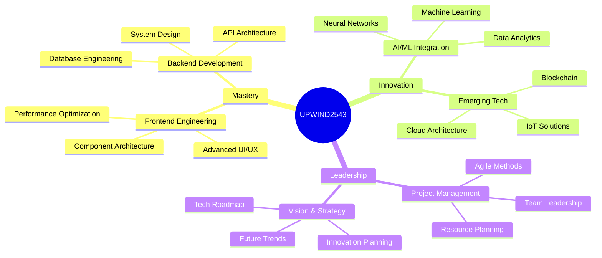

<div align="center">

```ascii
██╗░░░██╗██████╗░░██╗░░░░░░░██╗██╗███╗░░██╗██████╗░  ░░███╗░░███████╗░█████╗░░░██╗██╗██████╗░
██║░░░██║██╔══██╗░██║░░██╗░░██║██║████╗░██║██╔══██╗  ░████║░░██╔════╝██╔══██╗░██╔╝██║██╔══██╗
██║░░░██║██████╔╝░╚██╗████╗██╔╝██║██╔██╗██║██║░░██║  ██╔██║░░█████╗░░███████║██╔╝░██║██████╔╝
██║░░░██║██╔═══╝░░░████╔═████║░██║██║╚████║██║░░██║  ╚═╝██║░░██╔══╝░░██╔══██║███████║██╔══██╗
╚██████╔╝██║░░░░░░░╚██╔╝░╚██╔╝░██║██║░╚███║██████╔╝  ███████╗██║░░░░░██║░░██║╚════██║██║░░██║
░╚═════╝░╚═╝░░░░░░░░╚═╝░░░╚═╝░░╚═╝╚═╝░░╚══╝╚═════╝░  ╚══════╝╚═╝░░░░░╚═╝░░╚═╝░░░░░╚═╝╚═╝░░╚═╝
```

[](https://git.io/typing-svg)

<a href="https://www.youtube.com/@upwind2543">
  
</a>


</div>

<div align="center">

[](https://git.io/typing-svg)

<a href="https://www.youtube.com/@upwind2543"></a>
<a href="https://whatsapp.com/channel/0029Vab80HT60eBWA6FUvm1M"></a>


</div>

---

<div align="center">

### `🌟 Innovation Ecosystem 🌟`


</div>



---

### `💫 Professional Synopsis`

```typescript
interface TechVanguard {
  readonly codename: string;
  expertise: string[];
  innovations: Project[];
  mission: string;
}

class DigitalArchitect implements TechVanguard {
  readonly codename = "UPWIND2543";
  public expertise = [
    "System Architecture",
    "Full-Stack Development",
    "AI Integration",
    "Security Engineering",
    "Innovation Research"
  ];
  
  private readonly mission = "Revolutionizing Digital Landscapes";
  
  public innovations: Project[] = [
    {
      name: "Quantum Edge",
      type: "Advanced Computing",
      status: "Operational"
    },
    {
      name: "Neural Forge",
      type: "AI Platform",
      status: "Development"
    },
    {
      name: "Cyber Sentinel",
      type: "Security System",
      status: "Active"
    }
  ];

  constructor() {
    console.log("Initializing Digital Innovation Systems...");
  }

  public async innovate(): Promise<void> {
    while (true) {
      await this.createFuture();
      await this.pushBoundaries();
      await this.transform();
    }
  }
}
```

---

### `📊 Innovation Metrics`

<div align="center">


</div>

---

### `🎯 Elite Projects`

<div align="center">

| Project Codename | Innovation Type | Tech Arsenal | Status |
|-----------------|-----------------|--------------|---------|
| `🔮 Neural Nexus` | AI/ML Platform | Python, TensorFlow, Cloud | `Operational` |
| `🛡️ Quantum Shield` | Security System | Django, Cryptography | `Active` |
| `🌐 Meta Sphere` | Web3 Platform | React, Blockchain | `Development` |
| `🤖 Auto Matrix` | Automation Suite | Python, AI | `Testing` |

</div>

---

### `🧬 Innovation Philosophy`

```python
class InnovationMantra:
    def __init__(self):
        self.principles = {
            "vision": "Pioneering Digital Evolution",
            "approach": "Systematic Innovation",
            "commitment": "Perpetual Excellence",
            "impact": "Global Digital Transformation"
        }
        self.activate_protocols()

    async def activate_protocols(self):
        while True:
            await self.innovate()
            await self.evolve()
            await self.transform()
            await self.inspire()
```

---

<div align="center">

### `🌐 Digital Nexus`

<a href="https://www.youtube.com/@upwind2543"></a>
<a href="https://whatsapp.com/channel/0029Vab80HT60eBWA6FUvm1M"></a>

```ascii
╔════════════════════════════════════════╗
║ SYSTEM STATUS: OPERATIONAL             ║
║ INNOVATION PROTOCOLS: ACTIVE           ║
║ DIGITAL SIGNATURE: AUTHENTICATED       ║
║ QUANTUM ENCRYPTION: ENABLED            ║
╚════════════════════════════════════════╝
```


</div>
