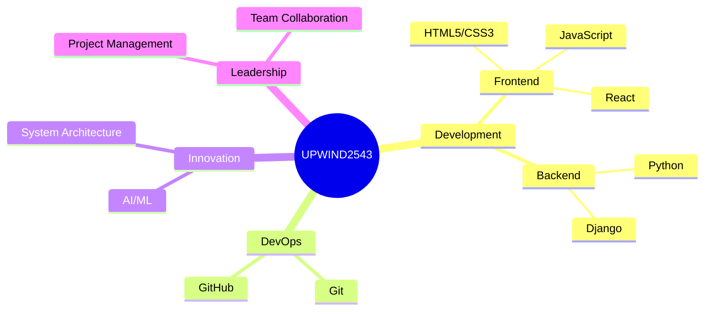

<div align="center">

```ascii
░█████╗░██╗░░░██╗██████╗░███████╗██████╗░  ██████╗░███████╗░█████╗░██╗░░░░░███╗░░░███╗
██╔══██╗╚██╗░██╔╝██╔══██╗██╔════╝██╔══██╗  ██╔══██╗██╔════╝██╔══██╗██║░░░░░████╗░████║
██║░░╚═╝░╚████╔╝░██████╦╝█████╗░░██████╔╝  ██████╔╝█████╗░░███████║██║░░░░░██╔████╔██║
██║░░██╗░░╚██╔╝░░██╔══██╗██╔══╝░░██╔══██╗  ██╔══██╗██╔══╝░░██╔══██║██║░░░░░██║╚██╔╝██║
╚█████╔╝░░░██║░░░██████╦╝███████╗██║░░██║  ██║░░██║███████╗██║░░██║███████╗██║░╚═╝░██║
░╚════╝░░░░╚═╝░░░╚═════╝░╚══════╝╚═╝░░╚═╝  ╚═╝░░╚═╝╚══════╝╚═╝░░╚═╝╚══════╝╚═╝░░░░░╚═╝
```

[](https://git.io/typing-svg)

[](https://www.youtube.com/@upwind2543)

</div>

<div align="center">
  
### `🌟 Digital Innovator | Code Architect | Tech Visionary 🌟`

[](https://www.youtube.com/@upwind2543)
[](https://whatsapp.com/channel/0029Vab80HT60eBWA6FUvm1M)
[](https://github.com/upwind2543)

</div>

---

<div align="center">

### `💫 Tech Mastery & Innovation 💫`



</div>

---

### `🚀 Professional Overview`

```python
class TechInnovator:
    def __init__(self):
        self.name = "UPWIND2543"
        self.role = "Digital Architect"
        self.language_spoken = ["ID", "EN"]
        self.fields_of_interest = [
            "Artificial Intelligence",
            "System Architecture",
            "Full Stack Development",
            "Cybersecurity",
            "Innovation Research"
        ]
    
    def say_hi(self):
        print("Thanks for dropping by! Let's create something extraordinary together!")

me = TechInnovator()
me.say_hi()
```

---

### `🎯 Expertise & Tools`

<div align="center">

#### Frontend Development


#### Backend Development


#### Development Tools


</div>

---

### `📊 Performance Analytics`

<div align="center">


</div>

---

### `🌐 Innovation Projects`

<div align="center">

| Project Name | Description | Tech Stack |
|-------------|-------------|------------|
| `🔒 Quantum Secure` | Advanced security system with quantum encryption | Python, Cryptography |
| `🤖 AI Assistant` | Intelligent automation system | Python, TensorFlow |
| `🌐 Web Platform` | Next-gen web application framework | Django, React |

</div>

---

### `🎓 Continuous Learning`

```javascript
const lifeGoal = {
    mission: "Perpetual Innovation",
    approach: "Learn & Adapt",
    focus: [
        "Emerging Technologies",
        "System Architecture",
        "AI/ML Integration",
        "Security Practices"
    ],
    motto: "Tomorrow's solutions, built today."
};
```

---

<div align="center">

### `🤝 Let's Connect & Innovate`

[](https://www.youtube.com/@upwind2543)
[](https://whatsapp.com/channel/0029Vab80HT60eBWA6FUvm1M)

```ascii
┌──┤ SYSTEM CONFIGURATION ├───────────▰▰▰
│
│  ▸ Status: Active
│  ▸ Mode: Innovation
│  ▸ Systems: Operational
│  ▸ Mission: In Progress
│
└───────────────────────────────────▰▰▰
```


</div>
